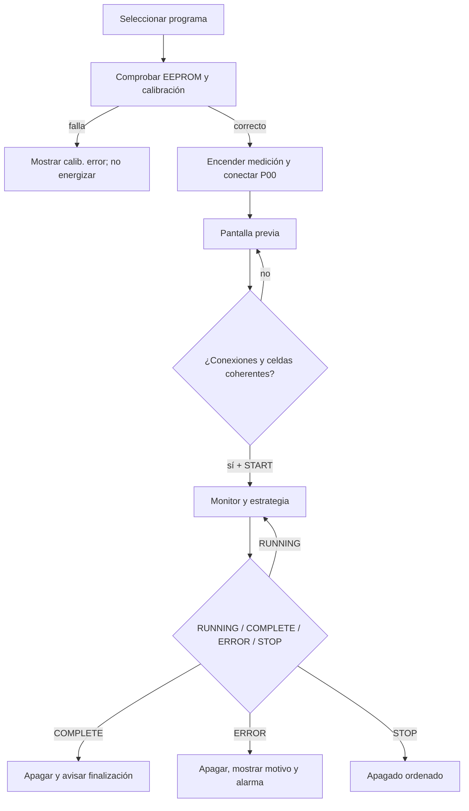

# Manual de funcionamiento del firmware cheali-charger

## Port iMAX B6 80W con CMS32L051

**Documento técnico y de uso basado en el código**

**Fecha del relevamiento:** 2026-08-20

**Rama:** `buck-boost-pruebas`

**Código analizado:** `998d2569` (`fix(cms32-CMS32L051): corregir ADC y corte de Vout`)

---

## 1. Propósito y alcance

Este documento explica el funcionamiento implementado por el firmware:

- arranque, controles, menús y perfiles;
- tipos de batería y programas disponibles;
- carga, carga con balanceo, carga rápida, descarga, almacenamiento, ciclos y control de capacidad;
- modelo de Thévenin, fórmulas, transiciones y condiciones de terminación;
- balanceador y estados mostrados;
- medición ADC, calibración, potencia, capacidad y energía;
- protecciones y mensajes;
- conversión de la consigna del core a corriente, PID, PWM, buck y boost en el CMS32L051;
- estado de validación, limitaciones y riesgos conocidos.

Se describe **lo que hace el código actual**, no el comportamiento ideal de un cargador comercial ni una recomendación universal para cualquier batería. Cuando el código difiere de una expectativa habitual, se documenta el comportamiento real.

### 1.1 Etiquetas de evidencia

- `[CÓDIGO]`: obtenido directamente del código fuente.
- `[MANUAL]`: respaldado por manual o datasheet del fabricante.
- `[ESQUEMA]`: respaldado por los esquemas de la placa B6-CMS V12.
- `[CONTINUIDAD]`: seguido físicamente con multímetro.
- `[MEDIDO]`: comprobado en placa bajo las condiciones de `AGENTS.md`.
- `[COMPILA]`: verificado solamente por compilación.
- `[PENDIENTE]`: aún no comprobado funcionalmente.
- `[RIESGO]`: puede dañar potencia, batería o instrumental.

### 1.2 Código fuente principal

El comportamiento genérico se encuentra en:

- `src/core/Program.cpp` y `ProgramData.cpp`;
- `src/core/strategy/`;
- `src/core/AnalogInputs.cpp`;
- `src/core/menus/` y `src/core/screens/`.

La adaptación CMS32L051 se encuentra en:

- `generic/50W/SMPS_PID.cpp`;
- `generic/50W/outputPWM.cpp`;
- `generic/50W/AnalogInputsADC.cpp`;
- `generic/50W/imaxB6.cpp`;
- `targets/imaxB6-80W-cms32L051/HardwareConfig.h`.

---

## 2. Advertencias de seguridad

> **PELIGRO:** este firmware controla un convertidor buck/boost y baterías capaces de entregar corrientes destructivas. Una calibración incorrecta, una celda mal detectada, una polaridad equivocada o un PWM erróneo puede destruir MOSFETs, pistas, batería, fuente o instrumental.

1. `[CÓDIGO][PENDIENTE]` El target conserva límites de **50 W y 5 A**, aunque el equipo se comercialice como “80W”. No elevarlos sin validación térmica y eléctrica gradual.
2. `[PENDIENTE]` Frecuencia, polaridad, extremos y transición buck/boost todavía requieren validación completa con osciloscopio.
3. `[PENDIENTE]` Descarga y balanceo no están funcionalmente validados como sistema completo.
4. `[RIESGO]` Para primeras pruebas usar fuente limitada, fusible, carga resistiva/electrónica y batería simulada; no una LiPo.
5. `[RIESGO]` Conectar la masa del osciloscopio sólo al GND común confirmado.
6. `[RIESGO]` `Options -> buck test` es una herramienta manual de laboratorio.
7. `[RIESGO]` `calibrate -> expert DANGER!` y las calibraciones de corriente pueden energizar salidas.
8. `[CÓDIGO]` El modo `LED` descarga primero el capacitor de salida durante 50 ms con consigna de 1 A. No usarlo con una batería conectada.
9. `[MEDIDO][PENDIENTE]` Con Vin=12 V, una 6S en 23,6 V ya está próxima al límite teórico del boost; una 6S llena a 25,2 V lo supera.

---

## 3. Controles, navegación y perfiles

### 3.1 Botones físicos

| Botón | Nombre interno | Función normal |
|---|---|---|
| `MODE` | `STOP` | Volver, cancelar o detener un programa |
| `MINUS` | `DEC` | Opción/página anterior o reducir valor |
| `PLUS` | `INC` | Opción/página siguiente o aumentar valor |
| `ENTER` | `START` | Entrar, aceptar, guardar o iniciar |

Los botones son activos en bajo, tienen antirrebote y aceleración al mantener `INC`/`DEC`.

En un menú, `START` entra y `STOP` vuelve. Durante una edición el valor parpadea: `START` lo acepta y `STOP` restaura el anterior.

`settings -> buttons: normal/rev` se guarda en EEPROM, pero `[CÓDIGO][PENDIENTE]` no es consultado por ninguna otra parte del código actual.

### 3.2 Perfiles

El menú principal contiene `options` y 20 posiciones de batería. Cada posición guarda química, capacidad, celdas, tensiones, corrientes y protecciones. Un perfil `None` sólo permite `edit battery`; al elegir química aparecen sus programas.

### 3.3 Procedimiento normal de uso

1. Alimentar el cargador con una fuente adecuada y limitada durante el desarrollo.
2. Elegir uno de los 20 perfiles.
3. Entrar en `edit battery` y comprobar química, celdas, capacidad, Vc/Vd/Vs, Ic/Id y protecciones.
4. Conectar primero los cables según el procedimiento seguro del banco; para LiXX de más de una celda conectar también el balanceador.
5. Elegir el programa.
6. Revisar la pantalla previa: química, celdas configuradas/detectadas, Vout y Vbalancer.
7. No confirmar si algún valor no coincide con el multímetro o con el pack.
8. Pulsar `START` para iniciar.
9. Durante el programa, usar `INC/DEC` para revisar corriente, tensiones, temperatura, límites y balance.
10. `STOP` detiene en cualquier momento y ejecuta el apagado de la estrategia.
11. Ante `ERROR`, registrar el motivo antes de modificar ajustes o reconectar.

En el estado actual del port este procedimiento no reemplaza la supervisión de banco: descarga, boost alto y balanceadores siguen pendientes de validación completa.

---

## 4. Arranque del equipo

Secuencia:

1. colocar pines en estado inicial seguro;
2. inicializar CPU y reloj;
3. copiar la sombra EEPROM desde flash a RAM;
4. inicializar LCD, ADC y PWM;
5. inicializar carga y descarga dejándolas apagadas;
6. cargar settings;
7. mostrar bienvenida;
8. comprobar firma, arquitectura, versiones y CRC;
9. ante EEPROM inválida, restaurar valores y mostrar `please calibrate`;
10. entrar al menú principal.

### 4.1 Estado eléctrico inicial del CMS32L051

| Señal | Pin | Estado | Efecto esperado |
|---|---:|---:|---|
| Corte de batería | P00 | alto | salida cortada |
| Carga/descarga | P20 | alto | descarga bloqueada |
| Topología | P21 | bajo | buck/reposo |
| PWM | P15 | bajo | 0 % |
| Balanceadores | seis salidas | bajo | bleed apagado |

`[ESQUEMA][CONTINUIDAD]` El mapeo está respaldado por esquema y continuidad. `[PENDIENTE]` La función completa de todas las rutas requiere prueba con potencia.

---

## 5. Flujo común de cualquier programa



### 5.1 Comprobación de calibración

Antes de cada programa se verifica:

- integridad/versiones de EEPROM;
- que `Vout+` represente 1…27 V;
- que `IsmpsSet` e `Ismps` cubran `minIc…maxIc`;
- que `IdischargeSet` e `Idischarge` cubran `minId…maxId`;
- que las rectas no estén invertidas, saturadas o comprimidas.

Si falla, la potencia no se inicia.

### 5.2 Pantalla previa

Muestra química, tensión nominal, celdas, programa, porcentaje, Vout, Vbalancer y celdas detectadas.

Bloqueos:

1. `Unknown` y `LED` no exigen detectar Vout.
2. Para LiXX, **todos los programas** exigen que las celdas configuradas coincidan con las detectadas.
3. Una LiXX 1S puede arrancar sin conector de balance.
4. Si falta el puerto exigido, el inicio queda retenido.
5. Si `|Vout - Vbalancer| > 0,5 V`, el inicio queda retenido.
6. El campo problemático parpadea y suena un aviso.
7. Deben soltarse los botones y confirmar `START` durante dos mediciones completas válidas.

En LiXX el puerto se exige como comprobación aunque el modo no vaya a balancear. Tras confirmar, sólo `+balance` o `balance` activan resistencias.

`[CÓDIGO]` NiZn es distinto: sus menús ofrecen `Charge+balance` y `Balance`, pero la pantalla previa sólo fuerza puerto y cantidad de celdas para la clase LiXX. Un programa NiZn con balance puede confirmarse sin conector; durante la estrategia no habrá celdas sobre las que actuar. Esto debe tratarse como una limitación de validación, no como permiso para omitir el puerto.

---

## 6. Unidades, medición y fórmulas básicas

### 6.1 Unidades internas

| Magnitud | Unidad | Ejemplo interno |
|---|---:|---:|
| Tensión | mV | 4,200 V = 4200 |
| Corriente | mA | 1 A = 1000 |
| Capacidad | mAh | 2,2 Ah = 2200 |
| Temperatura | 0,01 °C | 25 °C = 2500 |
| Potencia | 0,01 W | 50 W = 5000 |
| Energía | 0,01 Wh | 12,34 Wh = 1234 |
| Resistencia | mΩ | 0,125 Ω = 125 |

### 6.2 Calibración lineal

Para puntos `(x0,y0)` y `(x1,y1)`:

```text
y = y0 + (x - x0) * (y1 - y0) / (x1 - x0)
x = x0 + (y - y0) * (x1 - x0) / (y1 - y0)
```

Los cálculos son enteros y se recortan a 0…65535. Una recta que cruce cero dentro del rango configurado puede provocar errores `I charge 1/11` o sus equivalentes.

### 6.3 Límite por potencia

```text
I_mA = P_centiW * 10000 / U_mV
```

Ejemplo, 50 W a 12 V:

```text
I = 5000 * 10000 / 12000 = 4166 mA
```

En carga:

```text
Iefectiva <= min(Ic del perfil, settings.maxIc, settings.maxPc / Vout)
```

En descarga, el perfil se limita con `settings.maxId/maxPd`; en ejecución se vuelve a limitar por `settings.maxId` y `MAX_DISCHARGE_P` compilado.

El máximo permitido al editar un perfil se calcula con la **tensión de descarga predeterminada de la química**, no con la Vd editada ni con la tensión instantánea. Durante la ejecución de carga sí se recalcula el límite de potencia usando Vout real.

### 6.4 Potencia, carga y energía

```text
P_centiW = I_mA * V_mV / 10000
```

El tick es 500 µs. Cada 225 ticks (112,5 ms) se integra corriente:

```text
C_mAh = suma(I_mA * dt_horas)
```

La energía se integra desde `I*V` y se muestra en 0,01 Wh.

### 6.5 Corte de capacidad

```text
Clímite = capacidad_nominal * capCutoff / 100
```

Ejemplo: 2200 mAh al 120 % = 2640 mAh. Al alcanzarlo el programa termina como `COMPLETE`. En `LED` este límite se desactiva.

---

## 7. Tipos de batería y valores por defecto

| Tipo | Clase | Nominal/celda | Vc/celda | Vd/celda | Vs/celda | Vacía válida | Máx. por 27 V |
|---|---|---:|---:|---:|---:|---:|---:|
| `None` | especial | — | — | — | — | — | — |
| `NiCd` | NiXX | 1,20 V | 1,80 V | 0,85 V | — | 0,85 V | 15 |
| `NiMH` | NiXX | 1,20 V | 1,80 V | 1,00 V | — | 1,00 V | 15 |
| `Pb` | Pb | 2,00 V | 2,45 V | 1,75 V | 0 V | 1,90 V | 11 |
| `Life` | LiXX | 3,30 V | 3,60 V | 2,50 V | 3,30 V | 3,00 V | 7* |
| `Lilo` | LiXX | 3,60 V | 4,10 V | 2,50 V | 3,75 V | 3,50 V | 6 |
| `Lipo` | LiXX | 3,70 V | 4,20 V | 3,00 V | 3,85 V | 3,209 V | 6 |
| `L430` | LiXX | 3,70 V | 4,30 V | 3,00 V | 3,85 V | 3,209 V | 6 |
| `L435` | LiXX | 3,70 V | 4,35 V | 3,00 V | 3,85 V | 3,209 V | 6 |
| `NiZn` | NiZn | 1,60 V | 1,90 V | 1,30 V | 1,60 V | 1,40 V | 14* |
| `Unkn` | Unknown | editable | editable | editable | — | — | 1 |
| `LED` | LED | — | techo total | — | — | — | 1 |

`*` El cálculo de tensión permite 7S LiFe y hasta 14 NiZn, pero el hardware sólo tiene seis canales de balance. LiXX exige coincidencia de celdas, por lo que 7S LiFe no puede confirmarse con este port.

### 7.1 Programas visibles

| Tipo/clase | Programas actuales |
|---|---|
| `None` | Edit battery |
| LiXX | Charge, Charge+balance, Balance, Discharge, Fast charge, Storage, Storage+balance, Capacity check, Edit battery |
| NiZn | Charge, Charge+balance, Balance, Discharge, Fast charge, Capacity check, Edit battery |
| NiCd/NiMH | Charge, Discharge, D>C format, Capacity check, Edit battery |
| Pb | Charge, Discharge, Fast charge, D>C format, Capacity check, Edit battery |
| Unknown | Igual que Pb |
| LED | Charge, Edit battery |

Los ciclos LiXX/NiZn existen condicionalmente, pero no están habilitados en este target.

### 7.2 Valores derivados de capacidad

Al cambiar capacidad:

```text
Ic = capacidad              normalmente 1 C
Ic = capacidad / 4          para Pb, 0,25 C
minIc = Ic / 10
Id = capacidad              1 C
minId = Id / 10
```

Después se aplican límites globales. No es una garantía de que la batería admita esas tasas.

### 7.3 Valores NiXX predeterminados

- delta-V habilitado;
- NiMH: −5 mV/celda;
- NiCd: −15 mV/celda;
- ignorar delta-V durante 3 min;
- dT/dt: 1 °C/min con sonda externa;
- 5 ciclos D>C;
- cutoff externo: 60 °C;
- descanso base: 30 min.

---

## 8. Parámetros de “Edit battery”

| Campo | Función real |
|---|---|
| `battery` | Química, clase y programas |
| `V` | Cantidad de celdas |
| `Vc` | Tensión final por celda; total en Unknown/LED |
| `Vd` | Tensión mínima por celda |
| `Vs` | Tensión de almacenamiento por celda |
| `Vco` | Límite superior NiXX o techo LED |
| `Cap` | Capacidad nominal y base del cutoff |
| `Ic` | Corriente máxima de carga |
| `minIc` | Corriente de terminación/mínima de carga |
| `Id` | Corriente máxima de descarga |
| `minId` | Corriente mínima de descarga adaptativa |
| `bal. err` | Diferencia para recalcular la celda mínima tras una ronda combinada |
| `enab dV` | Habilita delta-V NiXX |
| `dV` | Caída por celda de terminación |
| `ignr frst` | Minutos sin aceptar delta-V |
| `extrn T` | Habilita sonda externa |
| `dT/dt` | Aumento máximo °C/min para NiXX |
| `extrn TCO` | Temperatura externa absoluta de error |
| `time` | Minutos activos; 1000 = sin límite |
| `cap COff` | Porcentaje de capacidad que finaliza |
| `D/C cycles` | Pares descarga/carga |
| `D/C rest` | Descanso entre fases |
| `adapt dis` | Descarga inmediata en Vd o reducción hasta minId |

El menú simple oculta campos avanzados, pero conserva sus últimos valores.

---

## 9. Motor de estrategias

Cada programa selecciona tres funciones:

```text
powerOn() -> doStrategy() repetidamente -> powerOff()
```

En cada vuelta:

1. se leen botones;
2. se actualiza la pantalla;
3. se ejecuta el monitor de seguridad;
4. con cada nueva medición completa se ejecuta la estrategia;
5. `STOP` interrumpe y llama siempre a `powerOff()`;
6. `COMPLETE` apaga salidas y muestra finalización;
7. `ERROR` apaga salidas, corta medición/salida y muestra el motivo.

Tras completar o fallar, si nadie pulsa un botón durante tres minutos, se desconecta la salida de batería.

---

## 10. Modelo de Thévenin y control CC/CV

Las cargas LiXX, Pb, NiZn y Unknown, además de descarga y storage, usan un modelo Thévenin.

### 10.1 Modelo

El firmware aproxima:

```text
Vterminal = Vth + I*Rth       carga
Vterminal = Vth - I*Rth       descarga
```

Desde cambios medidos:

```text
Rth = ΔV / ΔI
Vth = Vmedida - I * ΔV / ΔI
Inueva = (Vend - Vth) * ΔI / ΔV
```

En descarga `ΔV` se almacena negativo, por lo que la última ecuación mantiene corriente positiva.

### 10.2 Pack y celdas

Se mantiene un modelo para el pack y otro por celda detectada. La corriente seleccionada es:

```text
Inueva = min(I_pack, I_celda1, I_celda2, ...)
```

Así una celda puede limitar la corriente antes que la tensión total.

### 10.3 Actualización y filtrado

La corriente se recalcula cuando salida, corriente y celdas son estables, o cuando ya se alcanzó Vend y existe corriente previa. No se recalcula con bleed activo.

Cuando debe disminuir:

```text
Inueva_filtrada = (Inueva + Iactual) / 2
```

Luego se recorta al máximo del perfil y al mínimo aplicable.

### 10.4 Estados internos

1. `ConstantCurrentBalancing`: subida de corriente y balanceo inicial posible.
2. `ConstantCurrent`: corriente alta mientras no se alcance Vend.
3. `LastRthMeasurement`: al alcanzar Vend se ordena corriente cero.
4. `LastConstantCurrent`: se recalcula después de observar recuperación.
5. `ConstantVoltageBalancing`: corriente descendente manteniendo Vend y balance final.

El enum contiene `RthMesurment`, pero `[CÓDIGO]` ningún camino actual entra en él.

### 10.5 Finalización CC/CV

Debe cumplirse:

```text
estado == ConstantVoltageBalancing
Vend alcanzada
I <= minIc        en carga
I <= minId        en descarga adaptativa
balance completo  si fue solicitado
```

La condición debe repetirse durante 11 evaluaciones completas consecutivas (`fullCount_++ >= 10`). Cualquier incumplimiento reinicia el contador.

---

## 11. Funcionamiento de cada programa

### 11.1 Charge: LiXX, Pb, NiZn y Unknown

Estrategia: `TheveninChargeStrategy`.

1. inicializa el balanceador con salidas apagadas;
2. habilita carga con corriente cero;
3. inicializa Thévenin con `Vend = celdas * Vc`;
4. con mediciones estables calcula corriente inicial;
5. sube hacia `Ic`, limitada por potencia y ajustes;
6. si pack o celda alcanza Vc, reduce o corta momentáneamente corriente para observar recuperación;
7. entra en regulación de tensión y reduce corriente;
8. termina en `minIc` durante 11 evaluaciones válidas.

En `Charge`, `doBalance=false`: aunque el objeto balanceador se inicializa, las resistencias no deben actuar.

#### Pb

Implementa corriente constante y tensión constante hasta `minIc`. La etapa de flotación típica de plomo **no está implementada**; al completar apaga salida.

#### NiZn

Usa el mismo CC/CV a 1,90 V/celda; no usa delta-V.

#### Unknown

Usa CC/CV con una “celda” lógica y tensiones totales editables. No hay protección química específica.

### 11.2 Charge+balance

Es la carga Thévenin con `doBalance=true`:

1. encuentra la celda mínima;
2. activa bleed en todas las superiores;
3. limita cada ventana a unos 15 s;
4. apaga y espera estabilidad;
5. vuelve a calcular si persiste un error mayor que `bal. err`;
6. no termina hasta completar CC/CV y balanceo.

Si la corriente supera `max(160 mA, minIc)`, el core vuelve a considerar pendiente el balance. Los 160 mA son una constante lógica; no se mide ni regula la corriente real de cada resistencia.

### 11.3 Fast charge

Usa la misma carga Thévenin, cambiando sólo:

```text
minIc_fast = Ic / 5
```

No aumenta Ic ni Vc. Termina alrededor del 20 % de Ic y omite parte de la cola CV; por eso tarda menos.

`[CÓDIGO]` Esta asignación ocurre después de validar el perfil. Si `Ic/5` queda por debajo de `settings.minIc`, Fast charge puede solicitar una corriente que la comprobación global no cubrió. No usar corrientes pequeñas sin verificar la calibración en ese punto.

### 11.4 Charge: NiCd y NiMH

Estrategia: `DeltaChargeStrategy`.

1. comienza con `minIc`;
2. al superar Vd total solicita `Ic`;
3. cada ~30 s calcula tensión y temperatura promedio;
4. después del tiempo de ignorar delta-V conserva la máxima tensión vista;
5. termina por Vc, delta-V, dT/dt, capacidad o tiempo.

Delta-V total:

```text
dV_lim_total = celdas * dV_por_celda
```

Ejemplo NiMH 6S:

```text
6 * (-5 mV) = -30 mV
termina si Vactual - Vmáxima < -30 mV
```

La ventana térmica es aproximadamente 30 s:

```text
dT/dt ≈ 2 * (Tactual - Tanterior)   [°C/min]
```

Con corriente baja, delta-V puede ser insuficiente; tiempo y capacidad deben actuar como protecciones adicionales.

### 11.5 Discharge

Estrategia: `TheveninDischargeStrategy`.

1. bloquea carga y selecciona descarga;
2. inicializa con `Vend = celdas * Vd`;
3. solicita hasta `Id`, limitada por potencia/corriente/temperatura;
4. vigila pack y cada celda;
5. una sola celda en Vd basta para alcanzar el final.

```text
adapt dis = no:   Vd -> COMPLETE inmediato
adapt dis = yes:  Vd -> reducir corriente -> terminar en minId
```

La variante adaptativa intenta separar caída resistiva de tensión en reposo.

En CMS32L051 la descarga no usa el controlador integral rápido. `IdischargeSet` se convierte a PWM directo; la corriente medida alimenta pantalla, modelo y protecciones.

### 11.6 Balance

Es balance pasivo sin SMPS ni descarga principal:

- elige la celda mínima;
- nunca descarga esa celda;
- activa bleed en todas las superiores;
- no puede elevar una celda baja;
- no inicia si alguna está por debajo de Vd;
- usa ventanas de 15 s y pausas de estabilización;
- termina cuando ninguna queda por encima de la mínima.

`bal. err` no es el umbral directo de activación en `Balance`: la comparación es `Vcelda > Vmínima`. Ese parámetro se usa al combinar balanceo con Thévenin.

### 11.7 Storage y Storage+balance

```text
Vend = celdas * Vs_por_celda
```

Sin balanceador, carga si `Vbattery <= Vend`; con balanceador, carga si alguna celda está en o debajo de `Vend/celdas_detectadas`. En caso contrario descarga.

La rama de descarga fuerza método adaptativo. `Storage` no acciona bleed. `Storage+balance` llega primero a Vs y luego ejecuta balance pasivo.

### 11.8 D>C format

```text
Descarga -> descanso -> Carga -> descanso -> ... -> Carga final
```

Para `N` ciclos hay `2*N` fases activas. `D/C rest` define el descanso en minutos; la pantalla indica `W`.

`[CÓDIGO][RIESGO]` El menú permite `D/C cycles=0`, pero `N*2-1` desborda a 255. No seleccionar cero: puede producir una secuencia anormal y desbordar el historial de diez fases.

### 11.9 Capacity check

Ejecuta:

```text
Carga inicial -> descanso -> Descarga medida -> descanso -> Carga final
```

Reinicia acumuladores entre fases. La capacidad de interés es la descarga central; si todo termina normalmente deja la batería cargada.

### 11.10 LED

Estrategia: `SimpleChargeStrategy`.

1. descarga el capacitor de salida durante 50 ms;
2. empieza con `minIc`;
3. solicita `Ic` constante;
4. si Vout supera `Vco/Vc`, produce `ERROR: V limit`;
5. no regula tensión CV;
6. no tiene terminación natural por cola de corriente;
7. finaliza por tiempo, protección o STOP.

Es un modo de corriente para LED con techo de tensión, no una fuente general. No conectar baterías.

---

## 12. Balanceador en detalle

### 12.1 Detección y estabilidad

Una celda se considera conectada si:

```text
Vcelda > 0,400 V
```

Una magnitud es estable si varía 6 unidades internas o menos durante al menos tres mediciones. Para iniciar bleed se exigen seis mediciones estables por celda y salida/corriente estables. El comentario original estima ~0,7 s por medición; el tiempo CMS real no está caracterizado con precisión.

### 12.2 Selección

```text
balance_bit[i] = 1 si Vpresunta[i] > Vpresunta[minCell]
balance_bit[i] = 0 en otro caso
```

### 12.3 Compensación bajo bleed

Se guardan `Voff` antes de encender y `Von` inmediatamente después. Luego:

```text
Vpresunta = Vmedida + Voff - Von
```

Antes de tener `Von`, usa `Vpresunta=Voff`.

### 12.4 Ciclo

1. esperar estabilidad;
2. rechazar si alguna celda está bajo Vd;
3. calcular máscara;
4. encender resistencias;
5. guardar Von;
6. mantener hasta superar 15 s;
7. apagar;
8. esperar tres mediciones de recuperación;
9. repetir o terminar.

### 12.5 Símbolos

| Símbolo | Significado |
|---|---|
| espacio | apagado y estable/completo |
| `m` | esperando estabilidad |
| `b` | bleed activo, sin Von guardado |
| `B` | bleed activo con compensación |
| icono vacío | celda mínima |
| icono parpadeante | bleed activo |
| icono medio | conectada sin bleed |

---

## 13. ADC y magnitudes virtuales del CMS32L051

### 13.1 Rutas de adquisición

El ADC físico es 12 bits:

```text
raw12 = 0…4095
raw16_instantáneo = raw12 << 4
máximo = 65520
```

Cada canal acumula 256 muestras:

```text
raw16_oversample = (suma_256 + 8) >> 4
```

Puede aportar hasta cuatro bits de resolución si hay dither; no mejora offset, referencia ni linealidad.

Cada entrada se toma en ráfagas: se descarta la primera muestra tras cambiar canal y se promedian 70. `Ismps` aparece cuatro veces por vuelta y cada ráfaga llama al PID.

| Camino | Uso |
|---|---|
| promedio rápido de 70 | PID y cutoff rápido Vout+ |
| oversampling 256 + promedio del core | raw, calibración y mediciones generales |

### 13.2 Magnitudes virtuales

```text
Vout = max(Vout_plus - Vout_minus, 0)
Vb1 = max(Vb1_pin - Vb0_pin, 0)
Vb2 = max(Vb2_pin - Vb1_pin, 0)
Vbalancer = suma de celdas detectadas
```

La tensión usada como batería es:

```text
si Vbalancer != 0 y |Vout - Vbalancer| <= 3 V:
    Vbattery = Vbalancer
si no:
    Vbattery = Vout
```

La pantalla previa usa el límite más estricto de 0,5 V.

---

## 14. De la consigna al PID, buck y boost

### 14.1 Nivel alto

`SMPS::trySetIout(I)`:

1. limita corriente y potencia;
2. limita cada cambio a unos 140 mA (`0,7 * 200 mA`);
3. convierte mA a raw con `IsmpsSet`;
4. recorta raw a 60000;
5. entrega setpoint al controlador rápido;
6. reinicia estabilidad de mediciones.

### 14.2 Controlador integral

Aunque se llama PID, implementa sólo I:

```text
error = setpoint_raw - Ismps_fast_raw
integrador = integrador + 4 * error
```

Usa ocho bits fraccionales y limita la variable manipulada:

```text
0 <= MV <= 1,5 * 32760 = 49140
```

Al habilitar carga:

```text
si Vout_plus > Vin: MV inicial = 32760
si no:              MV inicial = 0
```

### 14.3 Buck

Para `0 <= MV <= 32760`:

```text
P21 = bajo
duty_P15 = MV / 32760
```

- MV=0: P15 GPIO bajo, 0 %.
- MV=32760: P15 GPIO alto, 100 %.

### 14.4 Cambio a boost

Para `MV > 32760`:

1. detiene P15 si cambia la topología;
2. pone P21 alto;
3. calcula `MV_boost = MV - 32760`;
4. aplica `duty_boost = MV_boost / 32760` en P15.

No hay demora intencional entre detener PWM, cambiar P21 y reanudar.

Máximo:

```text
MV = 49140
MV_boost = 16380
duty_boost = 16380 / 32760 = 50 %
```

Modelo ideal usado por el comentario:

```text
Dmax = 0,5
Vout <= Vin / (1-Dmax) = 2*Vin
```

No incluye pérdidas ni margen de regulación.

### 14.5 PWM físico

`[MANUAL][COMPILA]` TM41 usa canal maestro y esclavo, TO11 en P15, 48 MHz y período 1600 ticks:

```text
frecuencia = 48 MHz / 1600 = 30 kHz
resolución = 1/1600 = 0,0625 %
high_ticks = value * 1600 / 32760
```

0 % y 100 % se hacen como GPIO. En valores intermedios se reescribe `TDR11` sin reiniciar el temporizador.

### 14.6 Cutoff rápido

Al iniciar:

```text
Vcut = min(Vc_total + 3 V, 27 V)
```

Si `Vout_plus_fast_raw >= cutoff_raw`:

```text
PWM = 0
P21 = buck/reposo
PID = deshabilitado
registrar error externo
```

El monitor pasa luego a `ERROR` y el apagado final corta P00.

El cutoff rápido y el límite ADC del monitor usan **Vout+ físico**, no `Vout_plus - Vout_minus`. Esto es intencional en el código y puede resultar más conservador cuando Vout− no está cerca de cero.

`[MEDIDO]` La prueba vigente mostró corte de 27 V como `C59786` y `X0` en reposo. Confirma el cálculo a escala completa, no el boost 6S.

### 14.7 Apagado y descarga

Al apagar carga: setpoint cero, P15 bajo, P21 bajo, PID deshabilitado, P20 alto y finalmente P00 alto.

Al encender descarga: P15=0, P21 bajo y P20 bajo. El PWM proviene directamente de `IdischargeSet`. Al apagar pone P15=0, espera 10 ms, P20 alto y espera otros 10 ms.

---

## 15. Protecciones y terminaciones

| Condición | Criterio | Resultado |
|---|---|---|
| Temperatura interna | `Tintern > dischOff + 5,12 °C` | `ERROR: int.temp.cutoff` |
| Vout+ alta | ADC >= cutoff | PID off, luego `battery disc.` |
| Salida ausente en descarga | Vout+ < 0,4 V y descarga encendida | `battery disc.` |
| Error externo PID | bandera activa | `battery disc.` |
| Puerto de balance cambia | presencia distinta a la inicial | `balancer disc.` |
| Sobrecorriente | `Iout > maxI + 1 A` | `HW failure` |
| Vin baja | `Vin < input low` | `input V to low` |
| Temperatura externa | `Textern > extrn TCO` | `ext.temp.cutoff` |
| Capacidad | `Cout >= Clímite` | `COMPLETE: capacity cutoff` |
| Tiempo activo | minutos >= límite | `COMPLETE: time limit` |

La intención térmica de descarga es parar sobre `dischOff` y reanudar bajo `dischOff-5,12 °C`. `[CÓDIGO][RIESGO]` La variable de histéresis es local, no inicializada y no conserva estado; dentro de la banda el comportamiento no es fiable. La protección dura del monitor sí existe.

La polaridad inversa toma el control de menús/pantallas y activa alarma mientras Vout− exceda Vout+ por el umbral interno.

---

## 16. Manual completo de las pantallas

El LCD tiene 16 columnas y 2 filas. Durante un programa, `INC` avanza y `DEC` retrocede. La lista no es fija: el firmware habilita páginas según química, programa, estado de confirmación y presencia del puerto de balance.

### 16.1 Pantalla previa al inicio

Antes de energizar la estrategia aparece una página similar a:

```text
Lipo 22.2V/6C CB
85% 23.4V 23.4V6
```

Los campos reales son:

| Posición | Significado |
|---|---|
| Primera fila, izquierda | Tipo de batería |
| Primera fila, centro | Tensión nominal total y celdas configuradas |
| Primera fila, derecha | Abreviatura del programa |
| Segunda fila, izquierda | Porcentaje estimado por tensión |
| Segunda fila, centro | Vout de los bornes principales |
| Segunda fila, derecha, LiXX | Suma del puerto de balance y cantidad de celdas detectadas |
| Segunda fila, derecha, otras baterías | Capacidad configurada; en LED, corriente `Ic` configurada |

Abreviaturas:

| Código | Programa |
|---|---|
| `Ch` | Charge |
| `CB` | Charge+balance |
| `Bl` | Balance |
| `Di` | Discharge |
| `FC` | Fast charge |
| `St` | Storage |
| `SB` | Storage+balance |
| `CY` | D>C format |
| `CC` | Capacity check |

Si Vout, Vbalancer o cantidad de celdas no pasan la comprobación, el campo correspondiente parpadea. No significa que se esté balanceando: es una advertencia de conexión previa.

Durante esta confirmación también pueden recorrerse las páginas de tensiones de celdas, temperatura, límites y Vin. Las resistencias no aparecen todavía porque no existe un cambio de corriente del cual calcularlas.

### 16.2 Las 11 páginas de Charge+balance con 6S

Con una LiXX 6S y puerto válido, una vez iniciado `Charge+balance` aparecen exactamente estas 11 páginas, en este orden:

| Nº | Página | Primera fila | Segunda fila |
|---:|---|---|---|
| 1 | Principal | Capacidad acumulada; corriente | Estado; tiempo total; tensión de batería |
| 2 | Potencia/energía | Potencia; corriente | Energía; porcentaje estimado |
| 3 | Celdas 1…3 | Estado/iconos; V1 | V2; V3 |
| 4 | Celdas 4…6 | Estado/iconos; V4 | V5; V6 |
| 5 | R celdas 1…3 | Estado/iconos; R1 | R2; R3 |
| 6 | R celdas 4…6 | Estado/iconos; R4 | R5; R6 |
| 7 | Resistencias generales | `batt. R` | `wires R` |
| 8 | Tiempos | Límite; tiempo total | Tiempo de balance; tiempo con corriente |
| 9 | Temperaturas | Temperatura externa | Temperatura interna |
| 10 | Límites C/I/V | Capacidad límite; corriente máxima | Tensión final |
| 11 | Entrada | Vin medida | Cutoff de Vin configurado |

Las secciones siguientes definen cada una exactamente.

### 16.3 Página 1: capacidad, corriente, estado, tiempo y tensión

Distribución:

```text
[Cout, 8 chars][Iout, 8 chars]
[S][tiempo, 7][ ][Vbattery, 7]
```

- `Cout`: capacidad acumulada desde el comienzo de la fase actual, en mAh/Ah.
- `Iout`: corriente medida de carga o descarga.
- `S`: letra de estado descrita en 16.16.
- `tiempo`: tiempo de pared desde que se inició el monitor; incluye períodos con corriente cero y balanceo.
- `Vbattery`: `VoutBalancer`; normalmente es la suma de celdas si el balanceador es válido, y Vout principal si no lo es.

Que aparezca `C` no significa necesariamente que circule corriente: `C` indica que el objeto SMPS está encendido. La corriente real debe leerse en `Iout`.

### 16.4 Página 2: potencia, corriente, energía y porcentaje

```text
[Pout, 8][ ][Iout, 7]
[Eout, 8][  ][porcentaje][%]
```

```text
Pout_centiW = Iout_mA * Vout_mV / 10000
```

- `Pout`: potencia instantánea calculada.
- `Iout`: corriente medida.
- `Eout`: integral de potencia en Wh.
- `%`: estimación lineal por tensión, no estado de carga medido por coulomb counting.

La energía se actualiza más lentamente que corriente y tensión, porque el core integra bloques de `I*V`.

### 16.5 Páginas 3 y 4: tensiones de celdas

Formato de cada celda:

```text
1:4.20V
```

La primera mitad de la fila superior muestra el estado de balanceo o seis iconos; la segunda muestra V1 o V4. La fila inferior muestra las dos celdas siguientes.

```text
[estado/iconos 1…6][1:V1]
[2:V2            ][3:V3]
```

y luego:

```text
[estado/iconos 1…6][4:V4]
[5:V5            ][6:V6]
```

La tensión mostrada es `Balancer::getPresumedV()`:

- sin bleed, es la tensión calibrada de la celda;
- con bleed, se compensa la caída de la resistencia usando `Voff` y `Von`;
- antes de guardar `Von`, se conserva temporalmente `Voff`.

Por ello puede diferir de la lectura eléctrica instantánea bajo la resistencia de descarga.

### 16.6 Páginas 5 y 6: resistencia por celda

Tienen el mismo diseño que las páginas de tensión, pero cada valor es una estimación de resistencia en mΩ:

```text
[estado/iconos 1…6][1:R1]
[2:R2            ][3:R3]
```

y:

```text
[estado/iconos 1…6][4:R4]
[5:R5            ][6:R6]
```

La pantalla puede escribir, por ejemplo, `35mΩ`. El último carácter es el símbolo de ohm del juego de caracteres del LCD; según el módulo puede parecer un carácter especial.

Estas páginas no aparecen en el programa `Balance` standalone, porque sin una corriente del pack no existe un escalón útil para estimar resistencia interna.

### 16.7 Página 7: `batt. R` y `wires R`

```text
batt. R=   85mΩ
wires R=   22mΩ
```

- `batt. R`: resistencia estimada del pack completo por el modelo Thévenin.
- `wires R`: caída instantánea entre bornes principales y suma del balanceador, dividida por corriente.

La segunda fila sólo se imprime si el monitor guardó el puerto de balance como conectado al iniciar.

### 16.8 Página 8: tiempos

```text
[límite, 8][tiempo total, 8]
b[tiempo balance, 7][tiempo corriente, 8]
```

- arriba izquierda: límite del perfil en minutos o `nolimit`;
- arriba derecha: tiempo total desde el inicio del monitor;
- `b`: etiqueta fija de tiempo de balance;
- abajo izquierda: tiempo acumulado durante el cual `Balancer::isWorking()` fue verdadero;
- abajo derecha: tiempo con mando de carga o descarga distinto de cero.

El tiempo de balance incluye la ventana posterior en que las resistencias ya están apagadas pero el firmware espera estabilización. El tiempo con corriente no avanza cuando el SMPS está habilitado con consigna cero.

Formato temporal:

- hasta 999 minutos: `minutos:segundos`;
- por encima: minutos seguidos de `m`.

### 16.9 Página 9: temperaturas

```text
Text=      25.0C
Tint=      32.0C
```

- `Text`: temperatura externa. Si el perfil no habilita la sonda, muestra `N/A`.
- `Tint`: sensor interno del CMS32L051 convertido por su calibración.

La presencia de un número no garantiza exactitud: depende de que ambos canales estén calibrados.

### 16.10 Página 10: límites de capacidad, corriente y tensión

```text
[capacidad cutoff, 8][Strategy::maxI, 8]
Limits: [Strategy::endV, 7]
```

- capacidad cutoff: `capacity * capCutoff / 100`;
- corriente: máximo solicitado por la estrategia para esa fase;
- tensión: Vc, Vd o Vs total según programa.

La corriente mostrada es el límite lógico de la estrategia, no necesariamente la corriente instantánea ni el límite dinámico final por potencia.

### 16.11 Página 11: tensión de entrada

```text
Vinput=  12.00V
 limit=  10.00V
```

- `Vinput`: Vin calibrada medida.
- `limit`: `settings.inputVoltageLow`.

Si Vin cae por debajo del límite, el monitor termina en error `input V to low`.

### 16.12 Cómo se calculan los mΩ del pack

El modelo conserva una tensión/corriente anterior y busca un escalón de corriente aceptable.

Si la corriente aumentó:

```text
ΔI = Iactual - Ianterior
ΔV = Vactual - Vanterior
```

Si disminuyó:

```text
ΔI = Ianterior - Iactual
ΔV = Vanterior - Vactual
```

Sólo acepta el nuevo par si:

```text
|Iactual - Ianterior| > ΔI_aceptado_anterior / 2
signo(ΔV) == signo esperado del modelo
```

Entonces:

```text
R_pack_mΩ = |ΔV_mV| * 1000 / ΔI_mA
```

Ejemplo:

```text
Ianterior = 500 mA
Iactual   = 1500 mA
Vanterior = 23.400 V
Vactual   = 23.480 V

ΔI = 1000 mA
ΔV = 80 mV
R = 80 * 1000 / 1000 = 80 mΩ
```

Con balanceador válido, `Vbattery` suele ser la suma de celdas, por lo que `batt. R` intenta excluir la caída de los cables principales. Sin balanceador usa Vout principal y ya no puede separar ambas contribuciones.

### 16.13 Cómo se calculan los mΩ de cada celda

Para cada celda conectada se usa el mismo escalón de corriente del pack:

```text
R_celda_mΩ = |ΔV_celda_mV| * 1000 / ΔI_pack_mA
```

La tensión de celda es la tensión “presunta” compensada cuando hubo bleed. El core calcula un modelo independiente por celda y limita luego la corriente usando la celda que prediga alcanzar primero Vc o Vd.

Ejemplo:

```text
ΔI pack = 1000 mA
celda 4 sube de 3.920 V a 3.945 V
ΔV celda 4 = 25 mV
R4 = 25 * 1000 / 1000 = 25 mΩ
```

### 16.14 Cómo se calculan los mΩ de los cables

Esta cifra no usa un escalón; se calcula directamente:

```text
ΔV_cables = |Vout_principal - VoutBalancer|
R_cables_mΩ = ΔV_cables_mV * 1000 / Iout_mA
```

Con puerto válido, `VoutBalancer` es normalmente la suma de celdas. Ejemplo:

```text
Vout principal = 23.500 V
Vbalancer      = 23.460 V
Iout           = 2000 mA

ΔV = 40 mV
R_cables = 40 * 1000 / 2000 = 20 mΩ
```

El valor incluye todo lo que produzca diferencia entre ambas mediciones:

- cables positivo y negativo;
- conectores y contactos;
- soldaduras y pistas compartidas;
- diferencia de calibración entre Vout y balanceador;
- ruido y resolución ADC.

Por eso `wires R` no es una medición pura de un único cable. Con `Iout=0` se muestra 0, porque no se puede dividir.

### 16.15 Cuándo confiar en las resistencias mostradas

Al inicializar Thévenin, el firmware crea una resistencia provisional usando la diferencia entre tensión actual y tensión objetivo, dividida por `minI`. Hasta que se acepta un escalón real, el número mostrado puede ser esa inicialización y **no una medición física**.

Para considerar útil una lectura:

1. debe haber ocurrido al menos un cambio apreciable de corriente;
2. tensión y corriente deben haberse estabilizado;
3. el balanceador no debe estar activando bleed durante el cálculo;
4. ADC y tensiones deben estar calibrados;
5. la lectura debe repetirse de forma coherente en varios escalones.

El cálculo usa enteros: con ΔV pequeña, un código ADC de diferencia puede cambiar mucho el resultado. Las resistencias son diagnósticas, no una medición de laboratorio certificada.

### 16.16 Letras de estado de la pantalla principal

| Letra | Condición exacta del código | Interpretación |
|---|---|---|
| `C` | `SMPS::isPowerOn()` | Ruta de carga habilitada; puede tener corriente cero |
| `D` | SMPS apagado y `Discharger::isPowerOn()` | Ruta de descarga habilitada |
| `B` | Carga/descarga apagadas y `Balancer::isWorking()` | Balance standalone o fase final de Storage+balance |
| `W` | `DelayStrategy::isDelay()` | Descanso entre fases; reemplaza cualquier letra anterior |
| `N` | Ninguna condición anterior | Ninguna salida lógica activa |
| `E` | Rama existente pero inalcanzable en el código actual | No debería aparecer en este build |

La comprobación de `E` está dentro de una rama a la que sólo se entra cuando SMPS ya fue comprobado como apagado; por eso no puede hacerse verdadera.

En `Charge+balance` normalmente se ve `C`, incluso mientras el balanceador actúa, porque la prioridad de la letra de carga es mayor. El estado por celda se consulta en las páginas de celdas.

### 16.17 Letras e iconos de balanceo

Cuando no hay bits de bleed activos, el bloque izquierdo de las páginas de celdas muestra:

| Indicador | Condición exacta | Significado práctico |
|---|---|---|
| espacio | no trabaja y las celdas están estables | balance apagado/completo o esperando otra condición |
| `m` | no trabaja y alguna celda no alcanzó estabilidad | esperando mediciones estables |
| `b` | `isWorking=true`, máscara cero y `savedVon=false` | fase temprana o espera de estabilización sin Von guardado |
| `B` | `isWorking=true`, máscara cero y `savedVon=true` | normalmente recuperación después de una ventana de bleed |

`m` puede persistir aunque las tensiones redondeadas parezcan inmóviles: cada cambio de consigna reinicia todos los contadores de estabilidad, y se requieren seis mediciones consecutivas dentro de ±6 mV por celda para comenzar una ronda.

Cuando la máscara de bleed es distinta de cero, las letras desaparecen y se muestran seis iconos:

| Icono | Significado |
|---|---|
| batería vacía fija | celda mínima; no se descarga |
| batería llena/vacía parpadeante | resistencia de bleed activa; esa celda se está descargando |
| batería a media carga | conectada, sin bleed en esa ronda |
| espacio | celda no detectada |

El pack completo siempre recibe la misma corriente del SMPS. El firmware no “carga una celda individual”: sólo descarga en paralelo las celdas altas mientras la corriente principal atraviesa las seis celdas en serie.

### 16.18 Matriz de pantallas para todos los modos

Identificadores usados:

| ID | Página |
|---|---|
| `M` | Principal |
| `E` | Potencia/energía |
| `V13`, `V46` | Tensiones de celdas |
| `R13`, `R46` | Resistencias por celda |
| `RG` | batt. R / wires R |
| `T` | Tiempos |
| `Temp` | Temperaturas |
| `L` | Límites C/I/V |
| `Vin` | Entrada y cutoff |
| `D1`, `D2`, `D3` | Tres páginas delta NiXX |
| `CY` | Historial de ciclos |
| `LED` | Pantalla editable LED |

| Programa y química | Sin puerto de balance | Con puerto de balance válido |
|---|---|---|
| Charge LiXX | Sólo 1S: `M,E,RG,T,Temp,L,Vin` (7) | `M,E,V13,V46,R13,R46,RG,T,Temp,L,Vin` (11) |
| Charge Pb/NiZn/Unknown | `M,E,RG,T,Temp,L,Vin` (7) | Las 7 + `V13,V46,R13,R46` (11) |
| Charge+balance LiXX | Sólo 1S puede confirmar sin puerto: 7 | Las 11 detalladas arriba |
| Charge+balance NiZn | 7; el inicio no fuerza puerto | 11 |
| Fast charge LiXX/Pb/NiZn/Unknown | Igual que Charge para su conexión: 7 | 11 |
| Discharge LiXX/Pb/NiZn/Unknown | `M,E,RG,T,Temp,L,Vin` (7) | 11 |
| Storage LiXX | Sólo 1S: 7 | 11 |
| Storage+balance LiXX | Sólo 1S: 7 | 11; al pasar a balance final `M` cambia de `C/D` a `B` |
| Balance standalone | `T,Temp,Vin` (3) | `V13,V46,T,Temp,Vin` (5) |
| Charge NiCd/NiMH | `M,D1,D2,D3,E,RG,T,Temp,L,Vin` (10) | Las 10 + cuatro páginas V/R (14) |
| Discharge NiCd/NiMH | `M,D3,E,RG,T,Temp,L,Vin` (8) | Las 8 + cuatro páginas V/R (12) |
| D>C NiCd/NiMH | `M,CY,D1,D2,D3,E,RG,T,Temp,L,Vin` (11) | Las 11 + cuatro páginas V/R (15) |
| Capacity check NiCd/NiMH | Igual al ciclo NiXX: 11 | 15 |
| D>C Pb/Unknown | `M,CY,E,RG,T,Temp,L,Vin` (8) | 12 |
| Capacity check Pb/Unknown | `M,CY,E,RG,T,Temp,L,Vin` (8) | 12 |
| LED | `LED` efectiva | No corresponde |

Para cualquier química no LiXX, conectar un balanceador físicamente coherente puede habilitar páginas V/R aunque el programa no use bleed. En LiXX >1S el puerto es obligatorio antes de iniciar.

### 16.19 Páginas adicionales NiCd/NiMH

#### `D1`: capacidad/dT y estado/delta-V

```text
[Cout, 8][dT/dt, 8]
[estado+tiempo, 9][deltaV, 7]
```

Sin sonda externa, dT/dt muestra `N/A`.

#### `D2`: máxima tensión y delta-V

```text
maxV= [máxima retenida]
dV=   [Vactual - Vmáxima]
```

En carga NiXX, `maxV` deja de seguir hacia abajo cuando termina el período inicial de ignorar delta-V.

#### `D3`: temperatura externa y dT/dt

```text
Text= [temperatura o N/A]
dT/dt= [cambio por minuto o N/A]
```

En `Discharge` NiXX aparecen D3 pero no D1/D2. En D>C/Capacity check, las condiciones de pantalla dependen del programa exterior y no de la subfase; por eso D1/D2/D3 siguen visibles incluso durante la fase de descarga.

### 16.20 Página de ciclos `CY`

```text
[n][icono vacío][tiempo izquierda] [icono lleno][tiempo derecha]
[capacidad izquierda, 8][capacidad derecha, 8]
```

En un ciclo D>C normal:

- icono vacío/columna izquierda: descarga;
- icono lleno/columna derecha: carga;
- se alternan automáticamente los ciclos históricos.

El historial tiene diez fases. En Capacity check, que empieza con carga y luego descarga/carga, los índices quedan distribuidos literalmente por fase; la primera carga ocupa el lado derecho del primer par, la descarga el lado izquierdo del siguiente y la carga final su lado derecho.

### 16.21 Pantalla LED

```text
[estado+tiempo o Imax][Iout]
[Pout, 8][ ][Vout, 7]
```

`INC/DEC` cambian `Strategy::maxI` directamente y durante unas diez actualizaciones muestran ese máximo en lugar de estado/tiempo. Como la pantalla consume esas teclas, las demás páginas que resultarían elegibles por condiciones no son accesibles normalmente desde la página LED.

### 16.22 Formato de unidades

El firmware cambia automáticamente entre unidades base y prefijo mili según el espacio:

| Magnitud | Ejemplos de LCD |
|---|---|
| Corriente | `500mA`, `1.50A` |
| Capacidad | `850mAh`, `2.20Ah` |
| Tensión | `4.20V`, `23.6V` |
| Resistencia | `35mΩ`, `1.20Ω` |
| Potencia | `12.5W` |
| Energía | `3.40Wh` |
| Temperatura | `25.0C` |
| Tiempo límite | `120m` o `nolimit` |

El carácter Ω se codifica como `0xF4` para el ROM del LCD; en una fuente o emulador distinto puede verse como otro símbolo.

### 16.23 Porcentaje y ETA

```text
porcentaje = (V - Vvacía) / (Vcargada - Vvacía) * 100
```

Se recorta a 0…99 %. Es una interpolación de tensión, no coulomb counting.

La ETA conserva el mayor tiempo observado por punto porcentual:

```text
ETA = segundos_por_punto * (K - porcentaje)
K = 105 con balanceador; 100 sin él
```

### 16.24 Recorrido exacto de pantallas por cada modo

Esta sección aplica el significado de las páginas anteriores a **cada programa seleccionable en este target**. Los números son los que ve realmente el usuario al pulsar `INC`; al quitar páginas opcionales, las siguientes se corren de posición.

#### Charge LiFe/LiIo/LiPo/L430/L435

Para una LiXX de más de una celda, la pantalla previa exige que la cantidad configurada coincida con la detectada por el puerto de balance. En 1S permite comenzar sin ese conector.

Con puerto válido recorre 11 páginas:

```text
1 M -> 2 E -> 3 V13 -> 4 V46 -> 5 R13 -> 6 R46
    -> 7 RG -> 8 T -> 9 Temp -> 10 L -> 11 Vin
```

- `M`: `Cout` cargados, corriente positiva medida, `C`, tiempo y tensión total.
- `E`: potencia entregada por el cargador, energía acumulada y porcentaje por tensión.
- `V13/V46`: tensiones de las celdas. En `Charge` no hay bleed; los iconos no indican carga individual.
- `R13/R46`: resistencia estimada de cada celda usando los cambios de corriente de la carga.
- `RG`: `batt. R` del pack y `wires R` de ambos conductores/conectores.
- `T`: tiempo total, balance en cero salvo actividad ajena inesperada y tiempo efectivo con mando no nulo.
- `L`: límite de capacidad, `Ic` y `Vc_total`.
- `Vin`: alimentación del cargador y su cutoff.

Sin puerto, en 1S, son siete páginas reales:

```text
1 M -> 2 E -> 3 RG -> 4 T -> 5 Temp -> 6 L -> 7 Vin
```

En ese caso no hay resistencia individual ni `wires R`; `batt. R` usa Vout principal y puede incluir cables y contactos.

#### Charge Pb, NiZn y Unknown

Usan las mismas siete páginas sin puerto o las mismas 11 si se conectó un puerto de balance eléctricamente coherente. La diferencia está en el significado de `L` y en la estrategia:

| Química | Corriente en `L` | Tensión en `L` | Terminación |
|---|---:|---:|---|
| Pb | `Ic` | `celdas * Vc` | cola CV hasta `minIc`; sin flotación |
| NiZn | `Ic` | `celdas * 1,90 V` por defecto | cola CV hasta `minIc` |
| Unknown | `Ic` | Vc total editable | cola CV hasta `minIc` |

La conexión del puerto puede añadir mediciones V/R, pero `Charge` continúa sin activar bleed. En la pantalla previa de estas químicas, el campo derecho inferior muestra capacidad, no suma/cantidad de celdas. `Unknown` no exige presencia de batería en la misma comprobación previa que las químicas conocidas.

#### Charge NiCd/NiMH

Aquí la navegación cambia porque se agregan las tres páginas de detección delta. Sin puerto son diez:

```text
1 M -> 2 D1 -> 3 D2 -> 4 D3 -> 5 E
    -> 6 RG -> 7 T -> 8 Temp -> 9 L -> 10 Vin
```

Con un puerto válido se insertan cuatro páginas después de `E`, dando 14:

```text
1 M -> 2 D1 -> 3 D2 -> 4 D3 -> 5 E
    -> 6 V13 -> 7 V46 -> 8 R13 -> 9 R46
    -> 10 RG -> 11 T -> 12 Temp -> 13 L -> 14 Vin
```

- `M`: capacidad cargada, corriente, letra `C`, tiempo y tensión total.
- `D1`: capacidad y dT/dt arriba; estado/tiempo y delta-V abajo.
- `D2`: máxima tensión retenida y diferencia `Vactual - Vmáxima`.
- `D3`: temperatura externa y dT/dt.
- `L`: límite de capacidad, `Ic` y `Vc_total`; no muestra el umbral delta-V.
- `V/R`: sólo diagnóstico si se conectó el arnés; la estrategia NiXX no activa bleed.

Durante el tiempo inicial `deltaVIgnoreTime`, el máximo todavía puede seguir la tensión. Después, una caída suficientemente negativa, el dT/dt, Vc, capacidad, tiempo o temperatura pueden terminar la carga.

#### Charge+balance LiXX y NiZn

Para LiXX 6S con puerto válido son las 11 páginas desarrolladas una por una en 16.2–16.17. La secuencia es:

```text
M,E,V13,V46,R13,R46,RG,T,Temp,L,Vin
```

Las diferencias respecto de `Charge` se ven sobre todo en `V13/V46` y `R13/R46`:

- `m`: espera estabilidad;
- `b`/`B`: balanceador trabajando sin máscara activa en ese instante;
- icono parpadeante: bleed activo en esa celda;
- `C` en `M`: el SMPS tiene prioridad visual aunque el bleed también esté activo;
- tiempo `b` en `T`: acumula el período total en que el balanceador se considera trabajando.

En 1S LiXX puede comenzar sin puerto y quedan las siete páginas comunes, aunque no hay otra celda contra la cual balancear. En NiZn el menú ofrece este modo, pero la pantalla previa no obliga a conectar el arnés; sin él también quedan siete páginas y no habrá información individual.

#### Fast charge

La navegación es idéntica a una carga CC/CV común:

```text
con puerto: M,E,V13,V46,R13,R46,RG,T,Temp,L,Vin  (11)
sin puerto: M,E,RG,T,Temp,L,Vin                   (7)
```

Las páginas no muestran una etiqueta especial de “fase rápida”. La diferencia que debe interpretar el usuario es:

```text
minIc_fast = Ic / 5
```

`L` continúa mostrando `Ic` como corriente máxima y Vc como tensión final; **no muestra** `minIc_fast`. La corriente empieza igual que en Charge y el modo termina antes, al omitir parte de la cola de corriente baja. Está disponible para LiXX, NiZn, Pb y Unknown, no para NiCd/NiMH.

#### Discharge LiXX, Pb, NiZn y Unknown

Con puerto válido recorre 11 páginas; sin él, siete:

```text
con puerto: M,E,V13,V46,R13,R46,RG,T,Temp,L,Vin
sin puerto: M,E,RG,T,Temp,L,Vin
```

- `M`: `Cout` es capacidad **extraída**, `Iout` se muestra como magnitud positiva y la letra es `D`.
- `E`: potencia disipada y energía extraída; el signo visual sigue siendo positivo.
- `%`: porcentaje por tensión instantánea. Normalmente baja al descargar, pero no es capacidad remanente medida.
- `V13/V46`: permiten identificar qué celda llega primero a Vd. No hay bleed del balanceador en `Discharge`.
- `R13/R46` y `RG`: se calculan con los escalones de corriente de descarga.
- `T`: el contador derecho inferior avanza mientras el mando de descarga calibrado sea distinto de cero.
- `L`: límite de capacidad, `Id` y `Vd_total`.

Si `adapt dis=no`, alcanzar Vd completa la fase. Si está habilitado, puede verse reducirse `Iout` mientras el algoritmo intenta comprobar la tensión recuperada y termina cerca de `minId`.

#### Discharge NiCd/NiMH

Sin puerto son ocho páginas:

```text
1 M -> 2 D3 -> 3 E -> 4 RG -> 5 T -> 6 Temp -> 7 L -> 8 Vin
```

Con puerto válido son 12:

```text
1 M -> 2 D3 -> 3 E -> 4 V13 -> 5 V46 -> 6 R13 -> 7 R46
    -> 8 RG -> 9 T -> 10 Temp -> 11 L -> 12 Vin
```

`D1` y `D2` se ocultan expresamente en el programa exterior `Discharge`; `D3` permanece para mostrar temperatura y dT/dt. `L` contiene `Id` y Vd total. Igual que en otras descargas, corriente, capacidad, potencia y energía se presentan como magnitudes positivas.

#### Balance standalone

Con seis celdas detectadas sólo existen cinco páginas:

```text
1 V13 -> 2 V46 -> 3 T -> 4 Temp -> 5 Vin
```

Sin puerto lógico quedarían tres (`T,Temp,Vin`), aunque el programa no tendría celdas útiles sobre las cuales actuar.

No aparecen `M`, `E`, `R13/R46`, `RG` ni `L` porque:

- no hay SMPS ni descarga principal;
- no hay escalón de corriente del pack para calcular mΩ;
- no se integra capacidad/energía de bleed;
- el objetivo se decide comparando cada celda contra la mínima, no mostrando un Vc/Vd de estrategia.

En `V13/V46`, las letras e iconos de 16.17 son la indicación principal. En `T`, el tiempo `b` aumenta mientras el balanceador trabaja y el tiempo de corriente principal permanece en cero. El equipo sólo puede descargar celdas altas; si una está baja, no puede elevarla.

#### Storage LiXX

Tiene las mismas 11 páginas con puerto o siete sin puerto:

```text
con puerto: M,E,V13,V46,R13,R46,RG,T,Temp,L,Vin
sin puerto: M,E,RG,T,Temp,L,Vin
```

La letra de `M` revela la rama elegida:

- `C`: la batería/celda estaba baja y se está cargando hacia Vs;
- `D`: estaba alta y se está descargando hacia Vs;
- `N`: transición, consigna cero o salida ya apagada.

`Cout`, `Pout` y `Eout` se reinician al comenzar y acumulan la magnitud transferida por la rama seleccionada; no llevan signo para distinguir entrada de salida. `L` muestra la corriente máxima correspondiente a la rama (`Ic` si carga, `Id` si descarga) y `Vs_total`. `Storage` no activa bleed aunque existan páginas de celda.

#### Storage+balance LiXX

La navegación sigue siendo de 11/7 páginas. Primero se ejecuta la misma decisión de carga o descarga hacia Vs; después se inicia balance pasivo.

Cambios visibles esperados:

1. durante carga, `M` muestra `C` y la corriente del SMPS;
2. durante descarga, `M` muestra `D` y la corriente del descargador;
3. en la fase final de bleed, ambas rutas principales están apagadas y `M` muestra `B`;
4. `V13/V46` cambia entre `m`, `b`, `B` o iconos según la ronda;
5. en `T`, el tiempo de corriente deja de avanzar durante balance puro, mientras el tiempo `b` continúa.

En la fase final, `Cout/Eout` no incluyen la energía disipada por cada resistencia de bleed. Las páginas y acumuladores pertenecen al programa completo, pero el historial visible no separa automáticamente carga, descarga y balance.

#### D>C format NiCd/NiMH

Sin puerto aparecen 11 páginas:

```text
1 M -> 2 CY -> 3 D1 -> 4 D2 -> 5 D3 -> 6 E
    -> 7 RG -> 8 T -> 9 Temp -> 10 L -> 11 Vin
```

Con puerto se agregan V/R y llegan a 15:

```text
M,CY,D1,D2,D3,E,V13,V46,R13,R46,RG,T,Temp,L,Vin
```

La pantalla depende del programa exterior `D>C`, no de la subfase interna. Por eso:

- `D1/D2/D3` siguen visibles incluso cuando la subfase es descarga;
- `M` alterna `D`, `W` y `C`;
- `L` cambia sus valores al preparar cada subfase: `Id/Vd`, luego `Ic/Vc`;
- `Cout/Eout` se reinician en cada fase, no son el total de todos los ciclos;
- `CY` conserva tiempo y capacidad de hasta diez fases en columnas descarga/carga.

`W` significa descanso temporizado `D/C rest`: las salidas están apagadas y el tiempo principal continúa. No confundirlo con watts, que sólo aparece como unidad `W` junto a una cifra en la página de energía.

#### D>C format Pb y Unknown

No tienen páginas delta. Sin puerto son ocho:

```text
1 M -> 2 CY -> 3 E -> 4 RG -> 5 T -> 6 Temp -> 7 L -> 8 Vin
```

Con puerto válido son 12 al insertar `V13,V46,R13,R46` después de `E`. La lectura de fases, `D/W/C`, reinicio de acumuladores y página `CY` es igual a la descrita arriba.

En este build el menú D>C aparece para NiCd, NiMH, Pb y Unknown. Las entradas condicionales para LiXX/NiZn no están habilitadas por macros del target.

#### Capacity check

La secuencia eléctrica es:

```text
Carga inicial -> W -> Descarga medida -> W -> Carga final
```

Para NiCd/NiMH las páginas son las mismas 11/15 del ciclo NiXX:

```text
sin puerto: M,CY,D1,D2,D3,E,RG,T,Temp,L,Vin
con puerto: M,CY,D1,D2,D3,E,V13,V46,R13,R46,RG,T,Temp,L,Vin
```

Para LiXX, NiZn, Pb y Unknown son ocho sin puerto y 12 con él:

```text
sin puerto: M,CY,E,RG,T,Temp,L,Vin
con puerto: M,CY,E,V13,V46,R13,R46,RG,T,Temp,L,Vin
```

La capacidad que interesa para evaluar la batería es la fase central de descarga. `M/E` se reinician en cada fase; para consultar fases ya terminadas debe usarse `CY`. La columna con icono vacío es descarga y la de icono lleno es carga. La primera carga ocupa el lado de carga del primer par; la descarga central y la carga final quedan en el par siguiente debido a los índices literales 1, 2 y 3.

#### LED

El programa `Charge` de un perfil tipo LED abre efectivamente una sola página editable:

```text
[estado+tiempo o Imax][Iout]
[Pout             ][Vout]
```

- `C` significa que el SMPS está habilitado;
- `Iout`, `Pout` y `Vout` son mediciones instantáneas;
- `INC/DEC` cambian `Strategy::maxI` y muestran temporalmente ese valor arriba a la izquierda;
- no hay porcentaje, capacidad, energía, resistencia, balance ni navegación normal a otras páginas;
- Vc funciona como techo de error, no como regulación CV;
- el modo no termina por una cola de corriente: requiere STOP o una protección.

### 16.25 Pantallas al terminar, ante error y ante polaridad inversa

Al completar normalmente cualquier estrategia exterior se muestra:

```text
complete:[tiempo]
[motivo de parada]
```

El “motivo” puede ser final normal de la estrategia o un límite considerado finalización, como capacidad o tiempo. La salida se apaga antes de presentar esta pantalla.

Ante una protección clasificada como error:

```text
error:   [tiempo]
[motivo de error]
```

Ejemplos: batería desconectada, puerto de balance desconectado, corriente excesiva, Vin baja o temperatura excesiva. El buzzer usa el patrón de error y el equipo espera una tecla.

Si se detecta polaridad inversa, la navegación normal queda reemplazada por:

```text
REVERSE POLARITY
```

Esta advertencia tiene prioridad visual mientras la condición permanezca.

---

## 17. Ajustes globales del target

| Ajuste | Predeterminado | Función |
|---|---:|---|
| `disch off` | 60 °C | Umbral térmico de descarga/protección interna |
| `beep` | sí | Sonidos |
| `min Ic` | 50 mA | Mínimo global de carga |
| `max Ic` | 5 A | Máximo global de carga |
| `max Pc` | 50 W | Potencia máxima de carga |
| `min Id` | 50 mA | Mínimo global de descarga |
| `max Id` | 1 A | Máximo global de descarga |
| `max Pd` | 5 W | Potencia configurada de descarga |
| `input low` | 10 V | Cutoff de fuente de entrada |
| `UART` | disabled | Salida serie |
| `speed` | 57600 | Velocidad UART |
| `menus` | simple | Oculta parámetros avanzados |
| `buttons` | rev | Almacenado, actualmente no aplicado |

No aparecen ajustes de backlight ni fan porque el target no declara esas funciones. La temperatura interna sí está habilitada.

`[PENDIENTE]` Los menús UART son visibles, pero `TxHardSerial.cpp` y `TxSoftSerial.cpp` son stubs; habilitarlos no implica telemetría.

### 17.1 Menú Options

| Opción | Función |
|---|---|
| `settings` | Ajustes globales anteriores |
| `calibrate` | Tensión, corriente de carga/descarga y temperaturas |
| `reset default` | Restaura firma, calibraciones, perfiles y settings tras confirmación |
| `buck test` | Suite manual de laboratorio específica del CMS |
| `ADC raw test` | Visor de canales ADC con potencia cortada |

### 17.2 Herramientas de laboratorio

`ADC raw test` fuerza PWM apagado, balanceadores apagados y P00 cortado. Permite recorrer Vout±, corrientes, temperaturas, Vin y Vb0…Vb6, alternando el bloque oversampleado y el promedio largo.

`buck test` contiene:

- `PWM manual`;
- `buck/boost`;
- `power ADC`;
- `charge/disch`;
- `output P00`;
- `balancers`;
- `PID debug`.

Todas intentan entrar y salir con P15 bajo, P21 bajo, P20 alto, P00 alto y balanceadores apagados. Aun así son pruebas peligrosas: requieren armado explícito con `START` y montaje de banco. Boost está limitado al 50 % y la prueba de descarga al 20 % de duty.

---

## 18. Calibración

### 18.1 Tablas guardadas

Cada entrada física tiene dos puntos. Para corriente hay tablas separadas:

- `IsmpsSet` / `IdischargeSet`: mando crudo para una corriente esperada;
- `Ismps` / `Idischarge`: ADC crudo medido a esa corriente.

Ambas deben cubrir el rango global.

### 18.2 Tensión

El menú normal requiere batería y balanceador. Ajusta Vin y celdas. Al guardar una celda copia la suma del balance a Vout+/Vout− suponiendo divisores iguales. El circuito simplificado Vb0/Vb1/Vb2 necesita cálculos especiales para obtener celdas individuales.

### 18.3 Corriente

Para cada punto:

1. carga el mando raw guardado;
2. al editar `value` energiza carga o descarga;
3. muestra corriente calculada y ADC promedio;
4. `Iexpect` se ajusta a la medición externa real;
5. al aceptar guarda mando y ADC asociados;
6. escribe EEPROM después de volver a corriente cero.

`[RIESGO]` `value` es mando crudo, no mA. Un aumento puede provocar un salto grande.

### 18.4 Errores

| Subcódigo | Significado |
|---:|---|
| 1 | mínimo convierte a raw 0 |
| 2 | mínimo convierte a 65535 |
| 3 | máximo convierte a raw 0 |
| 4 | máximo convierte a 65535 |
| 5 | raw máximo <= raw mínimo |
| 6 | punto medio demasiado cerca del mínimo |
| 7 | punto medio demasiado cerca del máximo |

En corriente, `11…17` corresponden a la tabla de consigna y `1…7` a la medición física.

`[MEDIDO]` Ya se observó una calibración baja de corriente con raw físico cero y una tabla anterior de Vout inválida. Los valores heredados no deben considerarse seguros; cada equipo debe calibrarse con instrumental.

---

## 19. EEPROM y persistencia

Se guardan:

- firma `chli`, arquitectura y cantidad de celdas;
- versiones;
- calibraciones y CRC;
- 20 perfiles y CRC;
- settings y CRC.

CMS32L051 usa una sombra de 1 KiB en `0xFC00…0xFFFF`, copiada a RAM al arrancar. Las escrituras resincronizan la estructura.

`[MEDIDO]` El flasheo seguro conserva y compara EEPROM. `[PENDIENTE]` Siguen abiertos desgaste, tolerancia a corte y discrepancia 256/512 bytes en borrado flash.

---

## 20. Límites compilados actuales

```text
Tensión máxima:                  27,0 V
Corriente de carga:               5,0 A
Potencia de carga:               50,0 W
Corriente de descarga:            1,0 A
Potencia de descarga:             5,0 W
Celdas de balance:                6
PWM nominal:                     30 kHz
Duty buck:                        0…100 %
Duty boost:                       0…50 %
Escala ADC pública:               0…65520
```

Son restricciones de software, no certificaciones eléctricas o térmicas.

---

## 21. Anomalías y riesgos encontrados en revisión

1. **Ciclos en cero:** desborda a 255; no usar.
2. **Histéresis térmica:** variable local no inicializada; requiere corrección.
3. **`buttons: rev`:** se guarda pero no se aplica.
4. **UART:** opciones visibles con transmisores stub.
5. **LiFe 7S:** permitido por tensión, imposible de confirmar con seis canales.
6. **NiZn >6:** balance visible pero sólo seis salidas físicas.
7. **Balance standalone:** `bal. err` no define directamente qué salida enciende.
8. **Estado Thévenin:** `RthMesurment` no se alcanza.
9. **Descarga:** PWM calibrado sin lazo rápido cerrado.
10. **Potencia de descarga:** ejecución usa `MAX_DISCHARGE_P`; `settings.maxPd` limita principalmente el perfil.
11. **Reset de estabilidad:** cada cambio de consigna reinicia también estabilidad Vb1…Vb6; cambios continuos pueden retrasar balance.
12. **LED:** corriente constante con techo, no fuente CV.
13. **Pb:** sin flotación.
14. **Boost:** 50 % implica ~2×Vin ideal; no asegura 25,2 V desde 12 V bajo carga.
15. **Cambio buck/boost:** detiene PWM pero no agrega tiempo muerto intencional; debe medirse.
16. **NiZn con balance:** la pantalla previa no exige balanceador ni coincidencia de celdas para esta clase.
17. **Fast a corriente baja:** `Ic/5` puede quedar por debajo de `settings.minIc` después del chequeo de calibración.
18. **NiMH >6 celdas:** el cálculo de potencia usa un caso especial de tensión de descarga, pero la terminación real usa `cells * Vd_per_cell`; no son la misma fórmula.
19. **Pb/Unknown y ciclos:** `DCcycles` sólo se inicializa explícitamente al seleccionar NiCd/NiMH. Pb permite editarlo, pero puede heredar un valor anterior; Unknown ofrece `D>C format` sin mostrar ese campo y también puede heredar estado.

---

## 22. Estado de validación al 2026-08-20

### Comprobado

- `[MEDIDO]` LCD, botones, buzzer y navegación.
- `[MEDIDO]` flasheo seguro y preservación EEPROM.
- `[MEDIDO]` ADC oversampleado.
- `[MEDIDO]` recorrido ADC y llamada al PID tras corregir la carrera IRQ.
- `[MEDIDO]` cutoff Vout a escala completa (`C59786`, `X0`).
- `[ESQUEMA][CONTINUIDAD]` entradas, señales de potencia y balanceadores.
- `[COMPILA]` target CMS aislado.

### Pendiente

- comparar todos los ADC con multímetro;
- validar P00/P20/P21/P15 y todas sus transiciones;
- medir 30 kHz, duty, extremos, glitches y temperatura;
- validar buck y luego boost open-loop a baja potencia;
- validar lazo cerrado;
- repetir 6S con fuente limitada;
- validar descarga y cada balanceador;
- verificar térmica antes de elevar potencia;
- retirar menús de laboratorio antes de una versión final.

---

## 23. Resumen operativo por química

### LiFe / LiIo / LiPo / L430 / L435

- Balanceador obligatorio para packs >1S como verificación previa.
- `Charge`: CC/CV sin bleed.
- `Charge+balance`: CC/CV con bleed intermitente.
- `Fast`: misma Ic, termina en Ic/5.
- `Discharge`: directa o adaptativa hasta Vd.
- `Storage`: carga o descarga hasta Vs.
- `Storage+balance`: llega a Vs y luego iguala.
- `Balance`: sólo descarga celdas altas.

### NiCd / NiMH

- carga constante con V máxima, delta-V y opcional dT/dt;
- descarga Thévenin;
- ciclos D>C;
- capacity check carga-descarga-recarga;
- sin balanceador.

### Pb

- CC/CV a 2,45 V/celda;
- sin flotación;
- fast termina antes;
- descarga, ciclos y capacidad disponibles.

### NiZn

- CC/CV a 1,90 V/celda;
- balance limitado a seis canales;
- sin storage visible.

### Unknown

- tensión total editable;
- CC/CV genérico;
- sin protección química específica.

### LED

- corriente constante;
- Vco es techo de error;
- descarga inicial de capacitor;
- no conectar baterías.

---

## 24. Mapa rápido de código

| Tema | Archivo |
|---|---|
| Arranque | `src/core/ChealiCharger2.cpp` |
| Programas | `src/core/Program.cpp` |
| Químicas/límites | `src/core/ProgramData.cpp` |
| Menús por química | `src/core/menus/ProgramMenus.cpp` |
| Parámetros de perfil | `src/core/menus/ProgramDataMenu.cpp` |
| Ajustes | `src/core/Settings.cpp`, `SettingsMenu.cpp` |
| Bucle | `src/core/strategy/Strategy.cpp` |
| Carga/descarga | `TheveninChargeStrategy.cpp`, `TheveninDischargeStrategy.cpp` |
| Modelo | `Thevenin.cpp`, `TheveninMethod.cpp` |
| NiXX | `DeltaChargeStrategy.cpp` |
| Storage | `StorageStrategy.cpp` |
| Balance | `Balancer.cpp` |
| Protecciones | `Monitor.cpp` |
| Mediciones | `src/core/AnalogInputs.cpp` |
| Selección y orden de páginas | `src/core/screens/ScreenPages.h`, `Screen.cpp` |
| Campos, letras e iconos del LCD | `ScreenMethods.cpp`, `ScreenBalancer.cpp`, `ScreenCycle.cpp`, `ScreenStartInfo.cpp` |
| Formato de unidades | `src/core/LcdPrint.cpp` |
| ADC CMS | `generic/50W/AnalogInputsADC.cpp` |
| PID/buck/boost | `generic/50W/SMPS_PID.cpp` |
| PWM | `generic/50W/outputPWM.cpp` |
| Pines/rutas | `generic/50W/imaxB6-pins.h`, `imaxB6.cpp` |
| Límites | `targets/imaxB6-80W-cms32L051/HardwareConfig.h` |

---

## 25. Conclusión

El core calcula objetivos físicos y el port CMS los convierte en P00/P20/P21/P15. LiXX, Pb, NiZn y Unknown usan un control superior Thévenin que estima resistencia y tensión en vacío del pack y de cada celda, ajusta corriente, realiza una observación a corriente cero y termina tras una cola estable. NiCd/NiMH usan corriente constante con delta-V y dT/dt.

El balanceador descarga intermitentemente celdas superiores a la mínima y compensa la caída causada por sus resistencias. La carga CMS posee un controlador integral rápido que recorre buck 0…100 % y luego boost 0…50 %; la descarga usa PWM directo calibrado.

La arquitectura está integrada para continuar ensayos incrementales, pero no es todavía un cargador 80 W validado. La prioridad sigue siendo ADC, estados seguros, PWM, transición buck/boost, descarga y balanceo antes de usar baterías reales o elevar potencia.
